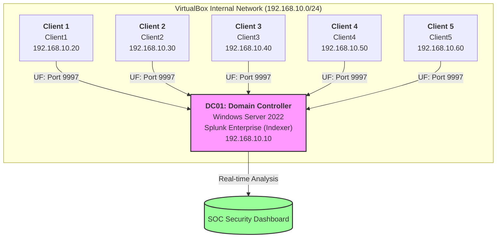

# AD Home-Lab with Splunk SIEM & Suricata IDS
Built a fully functional Active Directory home lab environment to simulate a corporate network and practice security monitoring. The lab includes a Windows Server 2022 domain controller, a Windows 11 domain-joined workstation, a Suricata IDS for network monitoring, and Splunk Enterprise as the central SIEM collecting and correlating security events in real time.

**Tools & Technologies**

VirtualBox — Hypervisor for running virtual machines
Windows Server 2022 — Domain Controller running Active Directory Domain Services
Windows 11 Enterprise — Domain-joined client workstation
Splunk Enterprise — SIEM for log collection and analysis
Splunk Universal Forwarder — Log shipping agent installed on both VMs
Active Directory Domain Services (AD DS) — User and computer management
DNS — Internal domain name resolution for lab.local

Ubuntu Server 24.04 — Host for Suricata IDS
Suricata with a Emerging Threats Open Ruleset - Open source network intrusion detection system with 50,000+ Suricata detection rules added on.

**Network Architecture**

DC01: Domain Controller / Splunk Server with ip static set as: 192.168.10.10
Suricata: IDS Network IDS / Ubuntu server with ip static attatched to 192.168.10.30
Client1: Domain-joined Workstation  ip static set as: 192.168.10.20
Client2: Domain-joined Workstation  ip static set as: 192.168.10.30
Client3: Domain-joined Workstation  ip static set as: 192.168.10.40
Client4: Domain-joined Workstation  ip static set as: 192.168.10.50
Client5: Domain-joined Workstation  ip static set as: 192.168.10.60

**Splunk Queries for dashboard**

Detect failed logins:
index=main source="WinEventLog:Security" EventCode=4625 | timechart count by host
Detect successful logins:
index=main source="WinEventLog:Security" EventCode=4624 | timechart count by host
Detect account lockouts:
index=main source="WinEventLog:Security" EventCode=4740 | table _time, Account_Name, Computer
Detect brute force pattern (multiple failures then success):
index=main source="WinEventLog:Security" (EventCode=4625 OR EventCode=4624) | timechart count by EventCode

**Steps taken**

Phase 1 — Active Directory Setup

Deployed Windows Server 2022 as a domain controller for lab.local
Configured Active Directory Domain Services, DNS, and DHCP
Created Organizational Units (OUs) and test user accounts
Joined a Windows 11 workstation to the domain
Configured static IPs and internal DNS resolution between VMs

Phase 2 — Splunk SIEM Deployment

Installed Splunk Enterprise on DC01 as the central log collection server
Deployed Splunk Universal Forwarder on both DC01 and Client01
Configured inputs.conf to collect Windows Security, System, and Application event logs
Opened firewall rules to allow log forwarding on port 9997
Verified log ingestion from both machines in Splunk

Phase 3 — Security Monitoring & Attack Simulation

Simulated brute force attacks by generating multiple failed login attempts
Triggered account lockout events through repeated authentication failures
Used Splunk SPL queries to detect and investigate security events
Built a real-time security dashboard with the following panels:

Failed Login Attempts (Event ID 4625)
Successful Logins (Event ID 4624)
Account Lockouts (Event ID 4740)

Suricata Network Alerts — table with timestamp, signature, source IP, destination IP

Phase 4 — Suricata IDS Deployment

Deployed Ubuntu Server 24.04 VM as a dedicated IDS node
Installed and configured Suricata 8.0 to monitor internal network traffic
Downloaded and enabled the Emerging Threats Open ruleset (50,000+ rules)
Created custom detection rules for lab-specific traffic patterns
Configured Suricata to generate alerts for ICMP, SSH, port scans, and suspicious connections

**Screenshots**

**Challenges and Troubleshooting**
My only two major and time consuming issues were getting the Windows 11 Eval fully operational, and getting the domain controller to communicate with the client.\

For the Windows 11 Eval, booting it in the Virtualbox VM would not boot the OS, I figured it was not a boot error because it would allow me to change the UEFI settings, my thought process was that the VM was already dedicating 80GB of disk space, which I had made different from the usual 50 thinking it would be enough, sure enough it was not. After allocating 100GB to the VM, The OS booted normally. After underestimating the total size needed to run my current 5 client workstation VMs, I purchased additional external hard drives be able to handle the payload for the future.

The Windows 11 client was unable to join the lab.local domain and could not reach the Domain Controller, despite being on the same virtual network. and after plenty of trial and error, I discovered that the Windows Defender Firewall was not allowing traffic to be received on port 9997. I fixed this by enabling the "Receiving" port (9997) within the Splunk Enterprise settings and then configured an inbound firewall rule on the Windows Server to allow traffic over TCP port 9997.

Could not copy/paste commands into the headless Ubuntu VM due to Guest Additions limitations (I do not enjoy typingn them out myself). Resolved by configuring a VirtualBox shared folder to transfer the installer file from the host machine.

Initial Suricata install had minimal rules loaded. Resolved by running suricata-update to download the full Emerging Threats Open ruleset (50,000+ signatures) and copying local rules to the correct directory.

**Future Goals**
Simulate additional attacks (pass-the-hash, Kerberoasting)
Integrate AI-powered log analysis using Python, LangChain, VirusTotal and Gemini
Fully Operational Ticketing System

